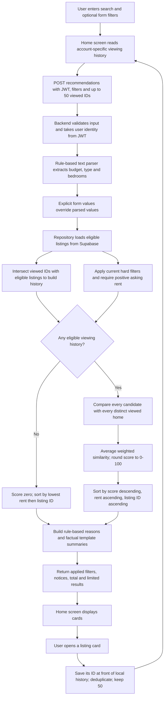
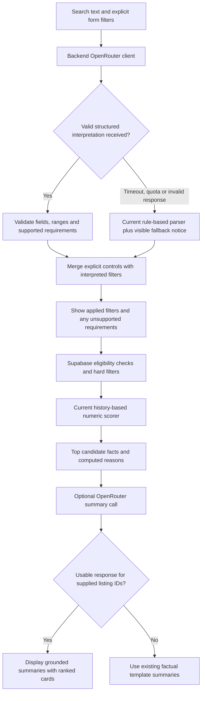

# Listing recommendations

## Singapore walkthrough: ordinary searches

**18 fictional sample listings have been added alongside the existing properties.** The app labels invented properties as “Sample listing” and their photos as illustrative. No special keyword is needed in the search box. These examples use ordinary searches across all eligible listings.

The neighbourhood names are Singapore locations, but the sample offers, rents and sizes are invented for testing. Photos do not affect scores. The detail screen skips government lookups for sample properties because they have no verified addresses, and enquiries to the sample owner are disabled.

### Walkthrough A: filtering versus personalised ranking

1. Open http://localhost:8081/HomeScreen and log in with your application account.
2. Open **Budget, bedrooms and property type**, press **Reset**, then **Clear viewing history**. Ensure the sort button says **Recommended**.
3. Search:

   ```text
   under 3000
   ```

   With no history, homes appear in ascending rental price. In the verification account, this returned 20 matches, starting with existing S$950 Tampines rooms, followed by S$1,300 and S$1,450 rooms. Counts may vary because your own properties are excluded and the shared data can change. Explain: **“The budget filters the results; with no preferences yet, the fallback sorts cheapest first.”**
4. Search:

   ```text
   Tampines Condo Reference
   ```

   Open **Tampines Condo Reference**, the S$2,800 two-bedroom condo, then go back. The search itself does not update history; opening the listing card does.
5. Repeat the original search:

   ```text
   under 3000
   ```

   With exactly that one viewed property and **Recommended** sorting, the first three should now be:

   | Position | Listing | Rent/month | Score |
   | --- | --- | --- | --- |
   | 1 | Tampines Condo Reference | S$2,800 | 100 |
   | 2 | Tampines Condo Budget Match | S$2,700 | 99 |
   | 3 | Tampines Condo Spacious Match | S$2,900 | 99 |

   Explain: **“The search and eligible homes are the same, but the order changes because I viewed a two-bedroom condo in Tampines. Similar homes move up.”** Previously viewed homes remain eligible, which is why the reference itself can stay first. The S$3,300 condo is still excluded by the budget.
6. Toggle to **Lowest rent**. Cheap rooms return to the top. Toggle back to **Recommended** to show the distinction between a price sort and personalisation.

Scores assume the sample records remain unchanged and exactly one reference home is in history. Opening additional listings changes the average. Clear history before repeating the walkthrough.

### Walkthrough B: show a different preference

Clear viewing history. Search:

```text
Woodlands HDB Budget Reference
```

Open that S$1,600 home, return, and search `under 3000` with **Recommended** sorting again.

| Leading listing | Rent/month | Score |
| --- | --- | --- |
| Woodlands HDB Budget Reference | S$1,600 | 100 |
| Woodlands HDB Budget Match | S$1,650 | 99 |
| Woodlands HDB Family Home | S$1,800 | 85 |

Explain: **“With the same budget filter, viewing a cheaper HDB in Woodlands produces a different ranking.”**

### More searches to copy

Reset explicit form filters first; they can override values parsed from search text.

| Search | What to show |
| --- | --- |
| `2 bedroom condo in Tampines under 3000` | Three sample matches satisfying type, area, minimum bedrooms and budget |
| `hdb in Woodlands under 2000` | Three sample HDB homes in Woodlands |
| `landed under 7000` | The two sample landed properties in Bedok and Bukit Timah |
| `under 500` | No matches in the current dataset; budget constraints are not silently relaxed |

Existing or newly added properties may also match these searches.

### What logic should I explain?

**“This is a content-based recommender. First it filters eligible homes. Then it compares each result against the homes I opened, using rent (40%), type (25%), location (25%) and bedrooms (10%). It averages those comparisons to calculate a score.”**

The weights are manually chosen. There is currently no LLM call or trained model, and your OpenRouter key is unused. An LLM is optional for this ranking exercise; the proposal's conversational-search and AI-summary features still require the separate integration described below.

### Seeded dataset

| Demo listing | Type | Area | Rent/month | Bedrooms |
| --- | --- | --- | --- | --- |
| Tampines Condo Reference | Condo | Tampines | S$2,800 | 2 |
| Tampines Condo Budget Match | Condo | Tampines | S$2,700 | 2 |
| Tampines Condo Spacious Match | Condo | Tampines | S$2,900 | 2 |
| Tampines HDB Family Home | HDB | Tampines | S$2,200 | 3 |
| Tampines Condo Above Budget | Condo | Tampines | S$3,300 | 2 |
| Bedok Condo Retreat | Condo | Bedok | S$2,600 | 2 |
| Bedok HDB Compact Home | HDB | Bedok | S$1,900 | 2 |
| Woodlands HDB Budget Reference | HDB | Woodlands | S$1,600 | 2 |
| Woodlands HDB Budget Match | HDB | Woodlands | S$1,650 | 2 |
| Woodlands HDB Family Home | HDB | Woodlands | S$1,800 | 3 |
| Jurong East HDB Family Home | HDB | Jurong East | S$2,300 | 3 |
| Jurong East Condo Retreat | Condo | Jurong East | S$3,000 | 2 |
| Punggol HDB Family Home | HDB | Punggol | S$2,100 | 3 |
| Punggol Condo Family Home | Condo | Punggol | S$3,200 | 3 |
| Bishan Condo Compact Home | Condo | Bishan | S$2,900 | 1 |
| Queenstown HDB Compact Home | HDB | Queenstown | S$2,400 | 2 |
| Bukit Timah Landed Garden Home | Landed | Bukit Timah | S$6,500 | 4 |
| Bedok Landed Family Home | Landed | Bedok | S$5,200 | 4 |

### Reproduce the seed and photo sources

The fixture data is in [scripts/recommendation-demo.tsv](scripts/recommendation-demo.tsv). From `RentNest`:

```sh
./scripts/seed-recommendation-demo.sh --preview  # Read-only preview
./scripts/seed-recommendation-demo.sh --apply    # Insert missing fixtures in one transaction
```

The script uses the configured PostgreSQL connection, inserts a reserved demo owner and a separate demo viewer, and identifies existing fixtures by owner and exact name. Re-running it preserves existing users/listings and inserts no duplicates. It does not reset altered fixtures. The initial demo owner password is randomly generated and not retained. The demo viewer's random credentials are stored only in `.recommendation-demo.properties`, with owner-only filesystem access and Git ignore coverage. Preserve that file for future demo-viewer logins; losing it does not reset the existing account's password. Normal users can use their own accounts instead. The script uses Java 21/Maven and its file-permission handling targets macOS/Linux.

Photo credits, also recorded in the listing descriptions:

- [deborah cortelazzi](https://unsplash.com/photos/gREquCUXQLI)
- [Roberto Nickson](https://unsplash.com/photos/rEJxpBskj3Q)
- [Huy Nguyen](https://unsplash.com/photos/AB-q9lwCVv8)
- [Francesca Tosolini](https://unsplash.com/photos/tHkJAMcO3QE)

These photos were selected from the free Unsplash collection and are used as illustrative demo images under the [Unsplash license](https://unsplash.com/license). They are loaded from remote image URLs; displaying them requires internet access.


## What is implemented right now?

The current recommender is a **content-based recommender with manually chosen weights**. “Content-based” means it compares the attributes of a candidate property with the attributes of properties this user has opened. It is deterministic: the same listings, history and search inputs produce the same order.

**There is currently no LLM call, model training, embedding model or collaborative filtering.** The 40/25/25/10 weights are initial engineering choices for the prototype, not weights learned from a dataset or proven optimal by evaluation. Price has the largest weight to favour a similar rental budget; type and location each have substantial influence; bedrooms have a smaller influence. These choices need evaluation with users before making claims about recommendation quality.

### What data is it based on?

| Input | Source | How it is used now |
| --- | --- | --- |
| Listing attributes | Existing Supabase `listings` records | Compare asking rent, property type, location text and bedroom count; construct factual card summaries. |
| Owner and tenancy information | Existing listing/user relationships | Remove own properties, occupied listings, flagged listings and listings from flagged/banned owners. |
| Current search and form controls | Home screen request | Apply strict budget, minimum-bedroom, property-type and text filters. |
| Recently opened listing IDs | AsyncStorage, separately for each account on this device | Look up the attributes of up to 50 distinct homes opened from the recommendation screen and use them as the preference reference. |

It does **not** currently use other tenants' clicks, popularity, ratings, bookings, rental transactions, market-price benchmarks, map distances, government amenity datasets, a saved search history or personal demographics. Size appears in the summary but does not affect the score. The current search changes which homes qualify; it is not an extra numeric scoring signal.

### Current end-to-end flow



There are two distinct steps:

1. **Eligibility and filtering:** determine which listings may appear. A high similarity score cannot override the user's maximum rent or other hard filters. If nothing matches, return an empty list.
2. **Ranking:** decide the order of those matching listings using similarity to viewed homes.

### How the search is interpreted today

For `2 bedroom condo in Tampines under $3,000`, the regular-expression parser extracts:

```json
{
  "minBeds": 2,
  "types": ["condo"],
  "maxPrice": 3000,
  "location": "tampines"
}
```

This is pattern matching, not language-model understanding. After removing recognised phrases and filler words, every remaining word must occur somewhere in the combined listing name, location or postal code. For fictional demo records, `demo` is also a searchable tag. The `location` response field therefore represents remaining search text, not a geocoded neighbourhood. It does not calculate distance or understand all natural-language expressions.

### Exact scoring logic

For each candidate `c` and viewed home `h`:

```text
rentSimilarity(c, h) = max(0, 1 - abs(c.price - h.price) / h.price)
typeMatch(c, h)      = 1 when normalised types match, otherwise 0
locationMatch(c, h)  = 1 when location strings match ignoring case/outer spaces, otherwise 0
bedroomMatch(c, h)   = 1 when bedroom counts match, otherwise 0

pairScore(c, h) = 40 × rentSimilarity(c, h)
                + 25 × typeMatch(c, h)
                + 25 × locationMatch(c, h)
                + 10 × bedroomMatch(c, h)

finalScore(c) = round(sum(pairScore(c, h) for each h) / numberOfViewedHomes)
```

“Condominium” is normalised to “condo”. Missing comparison attributes contribute zero; the weights are not redistributed to the remaining attributes. A viewed home with a missing/nonpositive rent contributes no rent similarity. Candidate homes must have positive rent to appear.

Every distinct viewed home has equal weight. Repeatedly opening the same home does not multiply its influence. The newest 50 distinct IDs are retained, but there is no recency weighting within those 50 and no timestamp-based decay. A home that becomes occupied, flagged or otherwise ineligible stops contributing to the history used for scoring. Previously viewed homes can still be recommended.

### Worked example

Suppose you have viewed **one S$2,800/month, two-bedroom condo in Tampines**. Your next search sets **only a maximum rent of S$3,000**, with no type/location restriction. Assume all candidates below meet the other eligibility rules.

| Candidate | Rent contribution /40 | Type /25 | Location /25 | Bedrooms /10 | Result |
| --- | --- | --- | --- | --- | --- |
| S$2,700 condo, Tampines, 2 bedrooms | `40 × (1 − 100/2800) = 38.57` | 25 | 25 | 10 | **99/100**, first |
| S$2,000 HDB, Bedok, 2 bedrooms | `40 × (1 − 800/2800) = 28.57` | 0 | 0 | 10 | **39/100**, second |
| S$3,400 condo, Tampines, 2 bedrooms | Not scored | — | — | — | Excluded: over budget |

The cheaper HDB qualifies, but the condo ranks higher because it resembles what you viewed. With no viewing history, the HDB would appear first because the fallback orders by lowest rent. With multiple viewed homes, each candidate's score is averaged across all of them.

### Where do explanations and summaries come from?

Reasons are currently Java rules:

- Active hard filters produce reasons such as “Within your budget” or “Meets your bedroom requirement”.
- Average rent similarity of at least 0.75 produces “Similar rent to homes you viewed”.
- A type, location or bedroom match against at least half the viewed homes produces its corresponding history reason.
- If none applies, a general availability/fallback reason is shown.

The summary is a string template populated from stored fields, for example `Condo in Tampines · S$2700/month · 2 bedroom(s) · 750 sq ft`. **Neither the summary nor the reasons are AI-generated today.** A score of 99 means strong attribute similarity under this formula, not a 99% chance you will like the home or evidence that its rent is fair.

## Where OpenRouter and the LLM would fit — proposed, not implemented

Your local `RentNest/application.properties` contains an `API_KEY` setting. The current Java code does not read that property and has no OpenRouter client. Adding the key alone does not activate AI, and no request was made with it while preparing this documentation.

The proposed integration keeps property eligibility and numeric ranking in the backend, and adds the LLM at two useful points:

| Stage | Current implementation | Proposed LLM role |
| --- | --- | --- |
| Before filtering | Regex extracts a few recognised phrases | Convert a conversational request into validated structured filters, including a list of unsupported/ambiguous requirements. |
| Candidate selection and scoring | Database eligibility checks plus weighted content similarity | Keep the current constraints and scorer as the reliable baseline. The LLM does not invent listings or override a budget. |
| After ranking | Java templates and fixed explanation rules | Rewrite supplied listing facts and score reasons into concise, user-friendly summaries. |

For example, `I'd like a condo in Tampines with at least two bedrooms, and my monthly budget tops out at three thousand` could become the same filters as the earlier structured example. Written-out amounts and varied phrasing are where an LLM can improve on the current parser.



### What still needs to be built for that flow

1. A backend OpenRouter client that reads `${API_KEY}` locally, sends authenticated requests, and has explicit model configuration. The key must stay out of the Expo bundle and request/response logs.
2. A structured search-output schema, response validation, and rules for combining interpreted filters with explicit controls. Unsupported requests must be surfaced; for example, “near MRT” cannot become a verified proximity filter until location/transport-distance data is added.
3. Bounded requests with timeouts, output limits and fallback behaviour for unavailable models, rate limits, malformed output or missing credentials. Cache repeated interpretations/summaries where appropriate.
4. A summary prompt that receives only the top listings' necessary public attributes and computed reasons. Match outputs to supplied listing IDs, reject unknown IDs, and retain template fallbacks. Listing text is input data, not an instruction to the model. A schema check alone cannot guarantee factual accuracy, so generated summaries also need grounding checks and evaluation.
5. Tests using mocked LLM responses, plus evaluation queries checking filter accuracy, unsupported requirements, summary faithfulness, latency and fallback behaviour. Recommendation weights should separately be evaluated against user feedback or held-out interactions; an API key does not train the scorer.

A prospective model choice is `openrouter/free`, which routes to available free models. Free routing can vary the selected model, and model availability/rate limits can affect responses. Structured outputs are supported by compatible models, so the integration must request the required capability and still validate responses. For repeatable lab evaluation, record the model actually used alongside results. These are proposed configuration choices, not settings currently consumed by the app. See [OpenRouter free routing](https://openrouter.ai/docs/cookbook/get-started/free-models-router-playground) and [structured outputs](https://openrouter.ai/docs/guides/features/structured-outputs).

**Accurate project description today:** “A deterministic content-based listing recommender using explicit filters and local viewing history.” After the proposed integration is built and tested, it can be described as “An LLM-assisted discovery system with structured intent extraction, content-based ranking and grounded listing summaries.”

## Run locally

This feature branch follows the existing `RentNest` backend and `frontend/RentNest` layout.

Backend (Java 21 and Maven):

```sh
cd RentNest
./run-local.sh
```

The backend uses `application.properties` in the `RentNest` root when launched here. Your existing file is valid in that location. Alternatively, put it in `src/main/resources/application.properties`; avoid maintaining two copies because the external file overrides packaged values. A safe template is at `src/main/resources/application.properties.example`. Real config files are ignored by Git. Generate a JWT signing key with `openssl rand -base64 32` if needed.

`run-local.sh` validates the existing database schema without changing it. Port 5432 in the supplied Supabase connection details is the pooler's session-mode port. Use your actual project username and password, not the masked values from the setup message. Passwords with `!@#` do not need quotation marks in Java properties files.

Frontend (a second terminal):

```sh
cd frontend/RentNest
npm ci
npm run web
```

Open http://localhost:8081 and sign up or log in with an application account. Supabase database credentials are not application login credentials. The backend is at http://localhost:8080 and API documentation is at http://localhost:8080/swagger-ui/index.html.

The frontend uses the browser hostname on web, the Expo host on iOS, and `10.0.2.2` on the Android emulator unless the API base URL is configured. For a physical phone, copy `.env.example` to `.env`, set `EXPO_PUBLIC_API_BASE_URL` to your computer's Wi-Fi IP with port 8080, and restart Expo. Only public settings belong in this file. This project uses Expo SDK 51; use the web build or an SDK-compatible development client for mobile testing.

A local PostgreSQL server is unnecessary when connecting to hosted Supabase; the backend already includes the PostgreSQL JDBC driver. DBeaver is an optional database viewer, not an application dependency. To use it, create a PostgreSQL connection using the exact host, port, database, username and password in your local properties file, with SSL required.

Configuration references: [Spring external configuration](https://docs.spring.io/spring-boot/reference/features/external-config.html), [Expo environment variables](https://docs.expo.dev/guides/environment-variables/).

## Try recommendations

1. Log in and open the home/search screen.
2. Search for `2 bedroom condo in Tampines under $3,000`, or use the budget, minimum-bedroom and property-type controls. Explicit controls override parsed values for the same filter.
3. Cards show factual summaries and matching reasons. Applied filters are visible above the cards. Empty results keep the requested constraints; they do not silently broaden the search.
4. Open a few listings and return home. Similar prices, types, locations and bedroom counts influence ranking.
5. Use **Clear viewing history** to reset personalisation. History is capped at 50 distinct listing IDs and stored per account on the device. It does not sync between devices. Merely typing a search does not add persistent search history.

## API

Authenticated `POST /api/listings/recommendations`:

```json
{
  "query": "2 bedroom condo in Tampines under $3,000",
  "minPrice": 1000,
  "maxPrice": 3000,
  "minBeds": 2,
  "types": ["Condo"],
  "viewedListingIds": [12, 19],
  "limit": 50
}
```

All fields are optional. Missing/null `types` allows the parser to infer types from the query; an explicit empty array means no type restriction. The current frontend sends null when no type buttons are selected. The API accepts at most 300 search characters, 50 positive history IDs and a result limit from 1 to 100. It rejects invalid numeric ranges and unsupported types with HTTP 400. The authenticated JWT principal supplies the user identity; there is no client-supplied user ID.

The response includes `mode`, `filters`, `notices`, `total` before truncation, and `recommendations`. Each card contains public listing fields, a 0–100 similarity `score`, `reasons`, and a factual `summary`.

Eligible listings have no current tenant, are not flagged, have an unflagged owner, and are not owned by the requesting user. Listings without a positive price are omitted. This legacy schema has no publication status or availability dates, so eligibility uses the existing tenant assignment. No schema migration or new Supabase table is needed.

Ranking averages similarity against distinct, currently eligible viewed homes:

- 40% rent similarity: `max(0, 1 - abs(candidateRent - viewedRent) / viewedRent)`.
- 25% property type match.
- 25% exact location match, ignoring case/outer whitespace.
- 10% bedroom count match.

Scores are similarity measures, not a probability or assessment of property quality. Ties sort by ascending rent, then listing ID. With no eligible history, every score is zero and the same stable ordering applies. Already viewed listings can remain in the results.

## Current limits and optional additions

This implementation is the deterministic fallback described in the proposal. It does not call an LLM. Search recognises HDB/Condo/Landed, numbered bedrooms, maximum budget (`under`, `below`, `up to`, `max`, `budget`), minimum budget (`over`, `above`, `at least`, `min`), comma-separated amounts and `k` amounts. Remaining words match name, location or postal code. Complex requests such as proximity to MRT, exclusions, amenity preferences and date availability are not interpreted; the UI shows the remaining text so users can simplify it.

Summaries only use stored listing attributes. They do not invent market price comparisons, amenities or travel times. The OpenRouter key is configured locally; the proposed backend integration above still needs to be implemented and validated for broader language understanding and AI-written summaries. Persisted search behaviour and cross-device profiles would also require a storage design. Candidate scoring currently happens in memory, appropriate for the lab prototype; larger datasets need bounded database retrieval/pagination.

LTA/URA keys are optional for recommendations but must be real for their existing government-data features. The existing frontend dependency tree reports npm audit findings; this branch retains the base repository’s Expo-aligned dependency versions; review and upgrade it separately before release or physical-device testing. Browser maps use an external map link; mobile retains the native map. Fair-pricing, chat AI and analytics are separate proposal features and are not implemented by this recommendation change.

## Verification

```sh
cd RentNest
JAVA_HOME=$(/usr/libexec/java_home -v 21) mvn test   # macOS
# On other systems with Java 21 configured: mvn test
cd ../frontend/RentNest
npx expo export --platform web
```

Backend tests use an isolated in-memory H2 database. Coverage includes parsing, strict filtering, cold-start order, personalisation, invalid input, limits, missing fields, eligibility, JWT access and browser CORS preflight. Tests do not write to Supabase.
